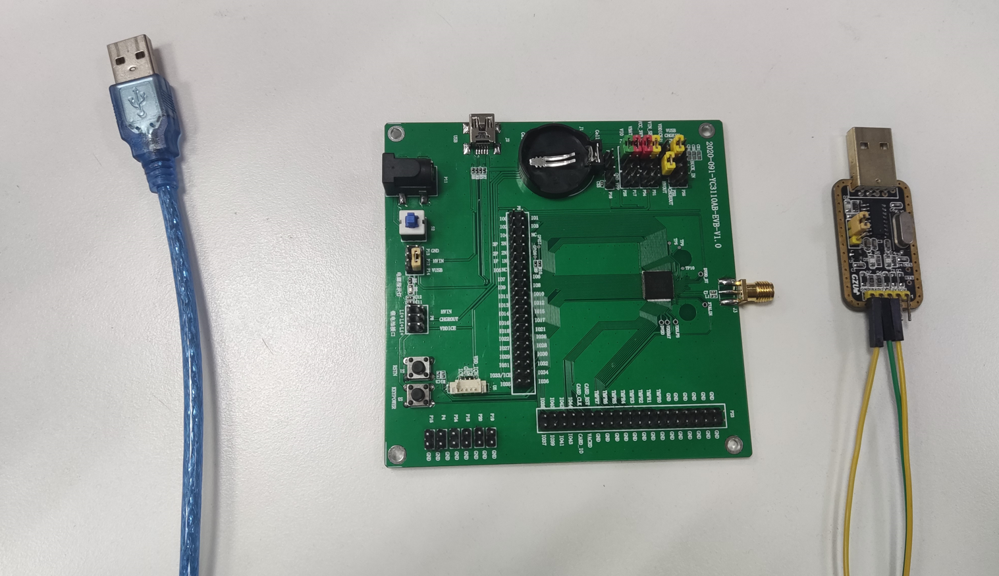
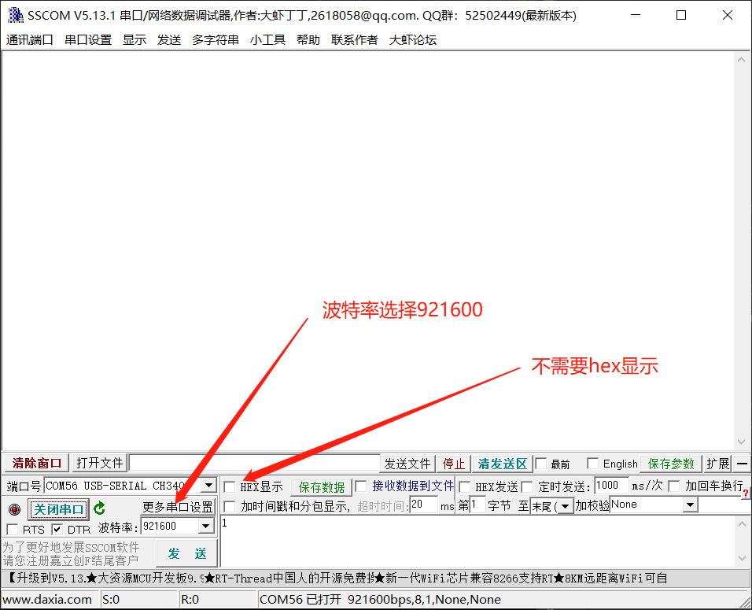
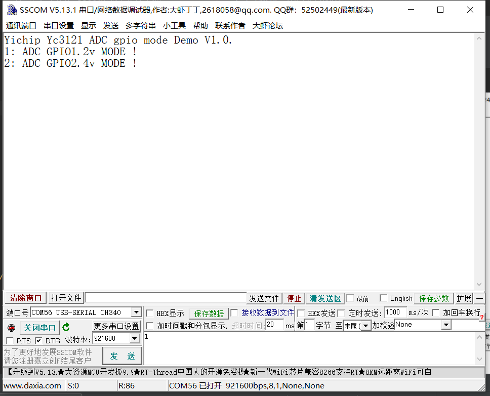
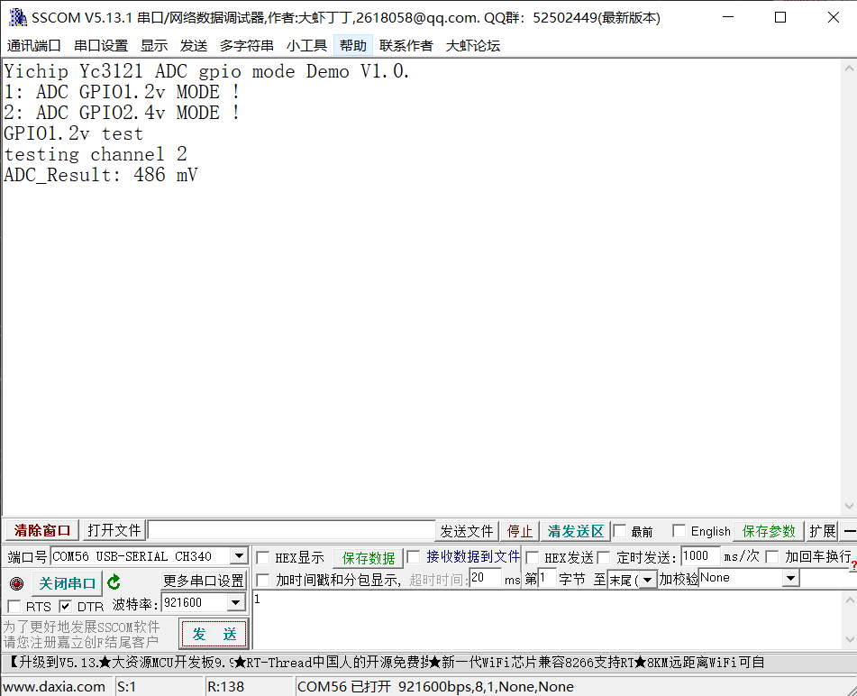

# YC3121
## 介绍
YC3121芯片使用 32bit RISC 内核处理器，集成Bluetooth 5.0 双模蓝牙（BR/EDR+BLE） 具有卓越的架构、高性能和超低功耗等特性， 提供高性能的及安全数据处理解决方案。
芯片内置硬件安全加密模块， 支持多种加密安全算法，包括 DES、 AES、SM2、SM3、SM4、ECC、 RSA、SHA、国密等主流加密算法。 具有多种攻击检测功能，符合金融安全设备标准。
芯片内部包含安全 BOOT 程序， 支持下载、启动时对固件进行 RSA 签名校验。 芯片内置512KB/1MB 可选安全 Flash、 64KB SRAM 和 8KB OTP 存储区。 同时集成了丰富的外设资源，所有外设驱动软件兼容目前主流安全芯片软件接口， 用户可在现有方案基础上进行快速开发和移植。

适用于金融安全设备、移动安全设备及其他对功耗和成本敏感的安全设备。


## 芯片相关数据
### _32-bit RISC 内核处理器_

● MPU保护单元

● 最高96MHZ主频，支持2，4，8分频

● 1个受控JTAG调试口

### _低功耗、高性能、高集成度Bluetooth 5.0 双模蓝牙（BR/EDR+BLE）_

● Single-end RFIO

● -93dBm in BLE mode

● support 250kbps, 1/2/3Mbps data rates

● Tx Power upto +6dBm

● frequency band：2400MHz-2483.5MHz

### _内存_

● 64K随机加扰SRAM

● 512KB/1MB可选安全存储Flash

● 8KB OTP

### _安全加密算法加速引擎_

● 对称算法：DES、TDES、AES-128/192/256、国密IV（SM4）

● 非对称算法：RSA-1024/2048、 国密 II（SM2）、ECC

● HASH 校验算法 ：SHA-1/224/256/384/512、 国密 III（SM3）

### _IO接口_

● 1个ISO7816接口，支持3V、1.8V供电● 2个UART接口

● 2个SPI接口，1个QSPI接口

● 8个32位TIMER（支持PWM）

● 1个IIC接口

● 6个DMA（SPI0、SPI1、UART0、UART1、IIC、MEMCP）

● 1个CRC模块

● 48个GPIO

● 1 个 USB接口

### _内置功能_

● 1个三轨磁条卡解码模块，支持ISO/ABA、AAMVA及IBM等标准卡

● 1个真随机数发生器

● 最多支持 8 个静态 Tamper 或 4组动态 Tamper(4 输出，4 输入)， 动/静态可配

● 1 组内部 Sensor（支持高低电压、高低温、 Mesh、时钟和 voltage glitch 等传感器）

● 1 块密钥存储区（32 X 32bit 支持硬件快速擦除）

● 1个看门狗模块

### _10 bit ADC模块_

● HVIN （锂电池）ADC 采集电压范围：3-5V

● GPIO（GPIO37-44） ADC 采集电压范围：0-1.2V


## 芯片手册
1. [YC3121芯片简介](https://gitee.com/chenqixiong/yc/blob/master/%E8%8A%AF%E7%89%87%E7%AE%80%E4%BB%8B/YC3121_%E8%8A%AF%E7%89%87%E7%AE%80%E4%BB%8Bv2.3.pdf)
2. [YC3121芯片数据手册](https://gitee.com/chenqixiong/yc/blob/master/%E8%8A%AF%E7%89%87%E6%95%B0%E6%8D%AE%E6%89%8B%E5%86%8C/YC3121_%E8%8A%AF%E7%89%87%E6%95%B0%E6%8D%AE%E6%89%8B%E5%86%8Cv1.3.pdf)

## 硬件材料
1. 56pin开发板原理图及PCB
   1. 如何使用56pin开发板，怎么供电？
   2. 提供操作视频
2. 80pin开发板原理图及PCB
   1. 如何使用80pin开发板，怎么供电？
   2. 提供操作视频


## 软件材料
1. [YC3121 SDK](https://gitee.com/chenqixiong/yc/tree/master/SDK)
2. [库接口使用手册](https://gitee.com/chenqixiong/yc/tree/master/%E5%BA%93%E6%8E%A5%E5%8F%A3%E8%AF%B4%E6%98%8E%E6%89%8B%E5%86%8C)


## 开发工具
1. [J-LINK调试工具说明](https://gitee.com/chenqixiong/yc/blob/master/YC3121MDKJLINKV1.1.pdf)
2. [固件下载工具](https://gitee.com/chenqixiong/yc/tree/master/tool)
   1. 提供固件下载操作视频

## 模块设计指南

### ADC接口
#### 简介
ADC(Analog-to-Digital Converter) 指模数转换器。是指将连续变化的模拟信号转换为离散的数字信号的器件。
ADC接口主要用来检测模拟电压信号量，用于电池电压检测，温湿度检测，TDS检测等应用。
#### 特性
ADC 有 8 个通道，最高采样率为 3MHz，最高采样精度为 10 比特，AD 的参考电压为 1.2V,校准值写在 OTP 中， 电压范围为 0~1.2V。
#### 相关硬件接口
ADC硬件通道对应的GPIO如下：

| ADC通道         | 对应的GPIO |
|---------------|---------|
| ADC_CHANNEL_0 | GPIO37  |
| ADC_CHANNEL_1 | GPIO38  |
| ADC_CHANNEL_2 | GPIO39  |
| ADC_CHANNEL_3 | GPIO40  |
| ADC_CHANNEL_4 | GPIO41  |
| ADC_CHANNEL_5 | GPIO42  |
| ADC_CHANNEL_6 | GPIO43  |
| ADC_CHANNEL_7 | GPIO44  |
#### ADC接口软件控制
**ADC使用示例** 

ADC 的具体使用方式可以参考如下示例代码，示例代码的主要步骤如下：
1. 配置串口初始化。
2. 串口发送“1”选择ADC量程在0到1.2V，串口发送“2”选择ADC量程0到2.4V。
3. 获取ADC通道2电压

```c
/* Private typedef -----------------------------------------------------------*/
/* Private define ------------------------------------------------------------*/
/* Private macro -------------------------------------------------------------*/
/* Private variables ---------------------------------------------------------*/
/* Private function prototypes -----------------------------------------------*/
void UART_Configuration(void);
void ADC_Configuration(ADC_ScaleTypeDef scale);

/**
  * @brief  Main program
  * @param  None
  * @retval None
  */
int main(void)
{
    UART_Configuration();

    MyPrintf("Yichip Yc3121 ADC gpio mode Demo V1.0.\r\n");
    MyPrintf("1: ADC GPIO1.2v MODE !\n");
    MyPrintf("2: ADC GPIO2.4v MODE !\n");
    uint8_t uartretval = 0;
    while (1)
    {
        if(UART_IsRXFIFONotEmpty(UART0))
        {
            uartretval =  UART_ReceiveData(UART0);
            switch (uartretval)
            {
            case '1':
                MyPrintf("GPIO1.2v test\r\n");
                ADC_Configuration(ADC_Scale_1200Mv);
                MyPrintf("ADC_Result: %d mV\n", ADC_GetVoltage(ADC_CHANNEL_2));
                break;
            case '2':
                MyPrintf("GPIO2.4v test\r\n");
                ADC_Configuration(ADC_Scale_2400Mv);
                MyPrintf("ADC_Result: %d mV\n", ADC_GetVoltage(ADC_CHANNEL_2));
                break;
            default:
                break;
            }
            uartretval = 0;
        }
    }
}

```
#### 示例
**材料准备**

1. YC3121开发板一套。
2. PC电脑，串口调试工具。
3. USB线。
材料准备图



如下图所示连线


**步骤**

本文以\SDK\ModuleDemo\ADC\ADC_gpio_mode这个DEMO为例，针对ADC做演示。
1.这里使用sscom作为我们演示的串口调试工具，为避免用户在测试过程中的一些疑问，这里先在sscom界面上设置界面如下

2.上电复位，串口会打印出如下示的内容，串口发送“1”选择ADC量程0到1.2V，串口发送“2”选择ADC量程0到2.4V
```c
Yichip Yc3121 ADC gpio mode Demo V1.0.
1: ADC GPIO1.2v MODE !
2: ADC GPIO2.4v MODE !
```
如下图所示

3. 串口发送“1”，即可采集到通道2的ACD值
```c
Yichip Yc3121 ADC gpio mode Demo V1.0.
1: ADC GPIO1.2v MODE !
2: ADC GPIO2.4v MODE !
GPIO1.2v test
testing channel 2
ADC_Result: 486 mV
```
如下图所示

#### 常见问题及故障排查

1. ADC为什么会不准?

   答：排查步骤1...;排查步骤2...

2. ADC采样时间为什么会很久？ 

   答：排查步骤1...;排查步骤2...
#### 相关资料以及购买链接
[YC3121_ADC_demo](https://gitee.com/chenqixiong/yc/tree/master/SDK/ModuleDemo/ADC)

### BlueTooth接口

### BT接口

### DMA接口

### EXTI接口

### FLASH接口

### GPIO接口

### IIC接口

### LPM接口

### OTP接口

### ROM BOOT接口

### RTC接口

### SPI接口

### SSC接口

### SYSCTRL接口

### SYSTICK接口

### TIMER接口

### TRNG接口

### UART接口

### USB接口

### WDT接口

### 电源模块说明

### PWM拓展使用说明

### 低功耗测试说明

### USB&蓝牙OTA说明

### 算法模块应用说明，包含SM2,SM3,SM4


## 参与贡献

1.  Fork 本仓库
2.  新建 Feat_xxx 分支
3.  提交代码
4.  新建 Pull Request


## 特技

1.  使用 Readme\_XXX.md 来支持不同的语言，例如 Readme\_en.md, Readme\_zh.md
2.  Gitee 官方博客 [blog.gitee.com](https://bing.com)
3.  你可以 [https://gitee.com/explore](https://gitee.com/explore) 这个地址来了解 Gitee 上的优秀开源项目
4.  [GVP](https://gitee.com/gvp) 全称是 Gitee 最有价值开源项目，是综合评定出的优秀开源项目
5.  Gitee 官方提供的使用手册 [https://gitee.com/help](https://gitee.com/help)
6.  Gitee 封面人物是一档用来展示 Gitee 会员风采的栏目 [https://gitee.com/gitee-stars/](https://gitee.com/gitee-stars/)
